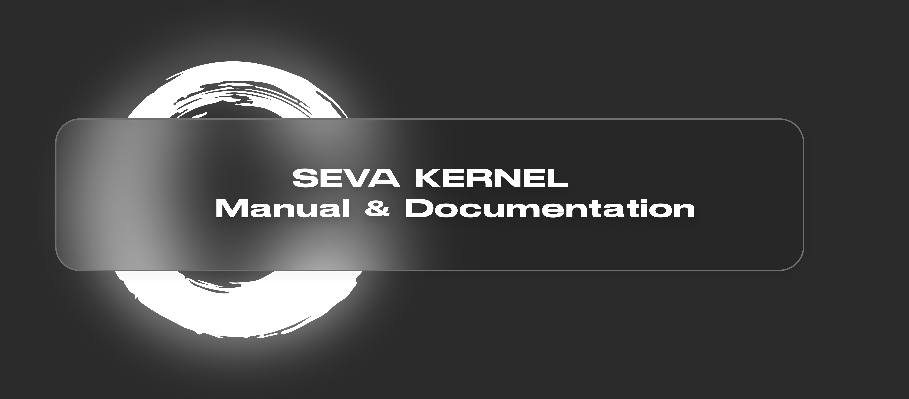

<h1 align="center">Seva Manual</h1>

## Meta

- [Building](meta/building.md)
- [Running the OS](meta/running.md)

## Utilities

Utilities are in progress, therefore haven't been documentated yet. As we strive to make the Seva Kernel POSIX compatible, we are unable to update this page real time. Please come back later.

## Design

- [The Operating System Design](design/README.md)

## Human Interface

- [Guidelines](human-interface/guidelines.md)
